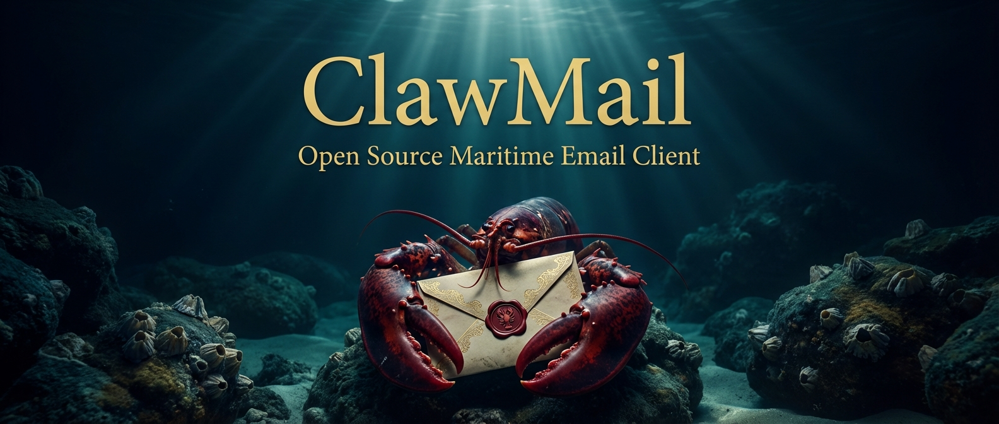

# ClawMail

Agent-first email client for macOS. Gives AI agents full programmatic access to email, calendar, contacts, and tasks via MCP, CLI, and REST API.

## What Is This?

ClawMail runs as a macOS menu bar daemon, maintaining persistent IMAP connections to your email accounts. AI agents (like Claude) interact with your email through three interfaces — no browser automation or credential sharing required.

```
Agent Interfaces:  MCP (stdio)  |  CLI  |  REST API (localhost:24601)
                        |            |              |
                  IPC (Unix domain socket, JSON-RPC 2.0)
                                     |
                         AccountOrchestrator
                 ______________|______________
                |      |       |      |       |
              Email  Calendar Contacts Tasks Guardrails
              (IMAP/  (CalDAV) (CardDAV) (VTODO) + Audit
              SMTP)                                 Log
```

The human UI exists only for setup and monitoring. All operations flow through the agent interfaces.

## Requirements

- macOS 14.0 (Sonoma) or later
- Swift 6 toolchain (Xcode 16+)
- Docker (optional, for integration tests)

## Installation

### From Source

```bash
git clone https://github.com/clawmail/ClawMail.git
cd ClawMail
make install
```

This builds a release binary, creates `ClawMail.app`, and installs it to `/Applications/ClawMail.app`.

If `BIN_DIR` is writable, `make install` also symlinks the CLI tools there. By default, `BIN_DIR=/usr/local/bin`:

| Symlink | Points to |
|---------|-----------|
| `/usr/local/bin/clawmail` | `ClawMail.app/Contents/MacOS/ClawMailCLI` |
| `/usr/local/bin/clawmail-mcp` | `ClawMail.app/Contents/MacOS/ClawMailMCP` |

If `/usr/local/bin` is not writable on your machine, the app install still succeeds and `make install` prints the direct executable path. You can either:

- rerun with `make install BIN_DIR="$HOME/.local/bin"`
- use `/Applications/ClawMail.app/Contents/MacOS/ClawMailCLI` and `/Applications/ClawMail.app/Contents/MacOS/ClawMailMCP` directly
- create the `/usr/local/bin` symlinks manually with `sudo`

Launch at login installs `~/Library/LaunchAgents/com.clawmail.agent.plist`, which starts `/Applications/ClawMail.app/Contents/MacOS/ClawMailApp`.

### Uninstall

```bash
make uninstall
```

Removes the app, symlinks, and LaunchAgent.

## First-Run Setup

1. **Launch ClawMail** — open from `/Applications` or run `open /Applications/ClawMail.app`. It appears as a menu bar icon (no Dock icon). On a first launch with no accounts configured, ClawMail opens Settings to the Accounts tab automatically and presents the add-account flow. If you close that window, you can reopen it from the menu bar icon.

2. **Add an account** — click the menu bar icon, open Settings, go to the Accounts tab, and click "+". The setup wizard walks through:
   - **Provider selection** (Apple/iCloud, Google, Microsoft 365 / Outlook, Fastmail, Other)
   - **Credentials** — server details and authentication
   - **Connection test** — verifies IMAP, SMTP, CalDAV, and CardDAV connectivity
   - **Label** — a short name used in CLI/API calls (e.g., `work`, `personal`)

3. **Configure guardrails** (optional) — Settings > Guardrails:
   - Send rate limits (per minute / hour / day)
   - Domain allowlist or blocklist
   - First-time recipient approval (requires human approval before sending to new addresses)
   - Held sends can be reviewed in Settings > Guardrails, via `clawmail recipients ...`, or through the `/api/v1/recipients/*` REST routes
   - If macOS notification permission is granted, ClawMail posts a local notification when a send is held for approval

4. **Connect an agent** — see [Agent Interfaces](#agent-interfaces) below.

**Need help?** See [`docs/ACCOUNTS.md`](docs/ACCOUNTS.md) for detailed setup instructions and troubleshooting for all providers.

For manual testing, a handy way to keep app logs visible without blocking your shell is:

```bash
: > /tmp/clawmail.stderr.log && tail -n 0 -F /tmp/clawmail.stderr.log &
open /Applications/ClawMail.app
```

### Apple / iCloud Setup

Apple documents iCloud Mail for third-party apps via app-specific passwords and [publishes the mail server settings separately](https://support.apple.com/102525).

1. Create an [app-specific password for your Apple Account](https://support.apple.com/121539)
2. In ClawMail, choose `Apple / iCloud`
3. Enter your iCloud email address and that app-specific password
4. ClawMail prefills Apple's published mail servers:
   `imap.mail.me.com:993` with SSL and `smtp.mail.me.com:587` with STARTTLS

### Google Setup

Recommended path:

1. Open the [Google Cloud Console credential guide](https://developers.google.com/workspace/guides/create-credentials)
2. In Google Cloud, create an OAuth client for a `Desktop app`
3. Configure the OAuth consent screen. If you want to test with a personal `@gmail.com` account, make sure the Google Auth platform `Audience` / user type is `External`. If the app is still in `Testing`, add your Google account as a test user
4. In Google Auth platform `Data Access`, make sure the Gmail, Calendar, and Google CardDAV scope `https://www.googleapis.com/auth/carddav` ClawMail requests are configured for the app
5. For Google Contacts via CardDAV, request `https://www.googleapis.com/auth/carddav`. In live testing, Google's CardDAV endpoint rejected tokens that had `https://www.googleapis.com/auth/contacts` but lacked the narrower CardDAV scope
6. If you want Google Calendar too, enable `CalDAV API` (`caldav.googleapis.com`) in the same Cloud project before you sign in
7. Copy the generated `Client ID` and paste it into `Settings > API > OAuth Client IDs > Google Client ID`
8. If Google gives you a client secret, paste it into `Google Client Secret` in ClawMail. If ClawMail later reports `client_secret is missing`, use the secret from that same OAuth client or recreate the client as a `Desktop app`
9. In ClawMail, choose `Google` and complete the browser sign-in flow
10. The email field in ClawMail is only a browser sign-in hint. After Google sign-in completes, ClawMail replaces it with the authorized Google address returned by Google so the account matches what you actually approved
11. ClawMail preconfigures Google's CardDAV discovery URL and derives the primary CalDAV URL from the authorized email address

If Google shows `Error 403: access_denied`, the most common causes are:
- The OAuth client is not a `Desktop app`
- The Google Auth platform `Audience` / user type is `Internal`, which only allows members of that Workspace or Cloud Identity organization
- Your Google account is not listed as a test user while the consent screen is still in `Testing`
- The app is requesting the restricted Gmail scope `https://mail.google.com/` without the broader verification Google requires for distribution beyond testing

If Google completes browser consent but ClawMail reports `client_secret is missing`, the token endpoint is rejecting that client without a secret. Paste the Google Client Secret from the same OAuth client into `Settings > API > OAuth Client IDs`, or recreate the client as a `Desktop app` and use the new Client ID and Client Secret together.

If Gmail IMAP and SMTP connect successfully but Google CalDAV still fails with HTTP `403`, the browser sign-in is working and the next thing to check is Google Cloud API enablement for `CalDAV API` (`caldav.googleapis.com`) in that same project.

If Gmail IMAP and SMTP connect successfully but Google CardDAV still fails with HTTP `403`, rerun browser sign-in after confirming Google Auth platform `Data Access` includes `https://www.googleapis.com/auth/carddav` for this app. In live testing, Google granted `https://www.googleapis.com/auth/contacts` but the CardDAV endpoint still challenged for the narrower CardDAV scope.

If ClawMail specifically reports `insufficient authentication scopes`, do not just press `Retry Test`. Go back and run Google browser sign-in again after confirming Google Auth platform `Data Access` includes the needed permission (`https://www.googleapis.com/auth/calendar` for CalDAV and `https://www.googleapis.com/auth/carddav` for CardDAV), because the existing token will not pick up newly added scopes by itself.

If you need password auth instead, use `Other Mail Account` with Gmail's IMAP/SMTP servers and a Google App Password. Regular account passwords are rejected with `5.7.8 BadCredentials`.

### Microsoft 365 / Outlook Setup

For OAuth2:

1. Open the [Microsoft Entra desktop app setup guide](https://learn.microsoft.com/en-us/entra/identity-platform/scenario-desktop-app-configuration)
2. Create or open your app registration in Microsoft Entra admin center
3. Set **Supported account types** to "Accounts in any organizational directory and personal Microsoft accounts" (this enables the `/common/` endpoint)
4. Copy the `Application (client) ID` and paste it into `Settings > API > OAuth Client IDs > Microsoft Client ID`
5. If your registration uses a client secret, paste it into `Microsoft Client Secret` in ClawMail (many desktop apps work without one)
6. Choose `Microsoft 365 / Outlook` in ClawMail and click "Open Browser"
7. **During sign-in**, ClawMail displays the exact redirect URI (e.g., `http://127.0.0.1:54321/oauth/callback`) with a copy button. Add this URI to your Entra app registration under **Authentication → Mobile and desktop applications**
8. Complete the browser sign-in flow

ClawMail preconfigures Outlook's IMAP/SMTP hosts. CalDAV/CardDAV support varies by tenant, so leave those blank unless your provider documents specific DAV endpoints.

**Common issues:**
- `invalid_client` (AADSTS7000215): The client secret is required but incorrect. Clear the secret field in ClawMail if your app registration doesn't have one, or ensure the secret value matches exactly.
- `userAudience` error: The app registration must be set to "All" account types, not "Personal Microsoft accounts only."

For App Passwords: use `Other Mail Account` and enable them via [Microsoft Account Security](https://account.microsoft.com/security) if your organization still allows basic auth.

### Fastmail Setup

Fastmail works best with an app password:

1. Create a [Fastmail app password](https://www.fastmail.help/hc/en-us/articles/360058752854)
2. In ClawMail, choose `Fastmail`
3. Enter your Fastmail address and app password
4. ClawMail prefills:
   - IMAP: `imap.fastmail.com:993`
   - SMTP: `smtp.fastmail.com:465`
   - CalDAV: `https://caldav.fastmail.com/dav/calendars/user/`
   - CardDAV: `https://carddav.fastmail.com/dav/addressbooks/user/`

## Agent Interfaces

### MCP (Primary)

Add to your Claude Code `.mcp.json` or MCP settings:

```json
{
  "mcpServers": {
    "clawmail": {
      "command": "/usr/local/bin/clawmail-mcp"
    }
  }
}
```

ClawMail provides 34 MCP tools across email, calendar, contacts, tasks, and administration. It also pushes server-initiated notifications for new mail, connection status changes, and errors.

Only one MCP session is allowed at a time (exclusive agent lock). CLI sessions run concurrently alongside.

### CLI

```bash
clawmail status                                          # daemon status
clawmail email list --account=work --folder=INBOX        # list messages
clawmail email send --account=work \
  --to="alice@example.com" \
  --subject="Report" \
  --body="See attached" \
  --attach="/path/to/report.pdf"                         # send with attachment
clawmail email search --account=work "from:bob invoice"  # full-text search
clawmail calendar list --account=work \
  --from=2026-01-01 --to=2026-01-31                      # list events
clawmail contacts list --account=personal --query="Alice" # search contacts
clawmail tasks create --account=work \
  --task-list=default --title="Review PR" --due=2026-03-10
clawmail recipients list                                 # approved recipients
clawmail recipients pending                              # held sends awaiting approval
clawmail recipients approve --account=work --request-id=<id> # release held send
clawmail recipients reject --account=work --request-id=<id>  # reject held send
clawmail recipients remove --account=work alice@example.com  # revoke approved recipient
clawmail audit list --account=work --limit=20            # audit log
```

Output defaults to JSON. Use `--format=text` for human-readable output.

**Available command groups**: `email`, `calendar`, `contacts`, `tasks`, `accounts`, `audit`, `recipients`, `status`

### REST API

Local HTTP server at `http://127.0.0.1:24601/api/v1`. Authenticated via Bearer token.

Retrieve the API key:

```bash
API_KEY=$(security find-generic-password -s "com.clawmail" -a "clawmail-api-key" -w)
```

Example requests:

```bash
# Check status (no auth required)
curl http://localhost:24601/api/v1/status

# List emails
curl -H "Authorization: Bearer $API_KEY" \
  "http://localhost:24601/api/v1/email?account=work&folder=INBOX&limit=10"

# Send email
curl -X POST -H "Authorization: Bearer $API_KEY" \
  -H "Content-Type: application/json" \
  -d '{"account":"work","to":[{"email":"alice@example.com"}],"subject":"Hello","body":"Hi there"}' \
  http://localhost:24601/api/v1/email/send

# Search
curl -H "Authorization: Bearer $API_KEY" \
  "http://localhost:24601/api/v1/email/search?account=work&q=from:bob+invoice"

# List held sends awaiting approval
curl -H "Authorization: Bearer $API_KEY" \
  "http://localhost:24601/api/v1/recipients/pending?account=work"

# Approve a held send by request ID
curl -X POST -H "Authorization: Bearer $API_KEY" \
  -H "Content-Type: application/json" \
  -d '{"account":"work","requestId":"req-123"}' \
  http://localhost:24601/api/v1/recipients/approve
```

Rate limited to 120 requests/minute.

**Endpoints**: `/email`, `/calendar`, `/contacts`, `/tasks`, `/accounts`, `/audit`, `/recipients`, `/recipients/pending`, `/recipients/approve`, `/recipients/reject`

## Search Syntax

Full-text search supports field-specific queries:

| Query | Description |
|-------|-------------|
| `invoice` | Free-text search across all fields |
| `from:alice` | Messages from alice |
| `to:bob@example.com` | Messages to a specific address |
| `subject:quarterly report` | Subject line search |
| `from:alice subject:invoice` | Combined filters |
| `has:attachment` | Messages with attachments |
| `from:alice budget` | Field filter + free text |

## Configuration

Config file: `~/Library/Application Support/ClawMail/config.json`

Most settings are managed through the Settings UI, but can also be edited directly:

```json
{
  "accounts": [],
  "restApiPort": 24601,
  "syncIntervalMinutes": 15,
  "initialSyncDays": 30,
  "auditRetentionDays": 90,
  "idleFolders": ["INBOX"],
  "launchAtLogin": true,
  "guardrails": {
    "sendRateLimit": { "maxPerHour": 20, "maxPerDay": 100 },
    "domainAllowlist": null,
    "domainBlocklist": ["competitor.com"],
    "firstTimeRecipientApproval": false
  },
  "webhookURL": "https://your-server.com/clawmail-webhook"
}
```

### Webhook Notifications

Set `webhookURL` in Settings > API to receive HTTP POST notifications when new mail arrives. Payload:

```json
{
  "event": "newMail",
  "account": "work",
  "folder": "INBOX",
  "messageId": "msg-123",
  "from": "alice@example.com",
  "subject": "Hello",
  "timestamp": "2026-03-05T10:30:00Z"
}
```

### Local Approval Notifications

When first-time recipient approval blocks a send, ClawMail requests macOS notification permission at launch and posts a local notification identifying the affected account and recipients. Delivery failures are non-fatal and logged to stderr.

## Data Locations

| Item | Path |
|------|------|
| Config | `~/Library/Application Support/ClawMail/config.json` |
| Database | `~/Library/Application Support/ClawMail/metadata.sqlite` |
| IPC socket | `~/Library/Application Support/ClawMail/clawmail.sock` |
| IPC token | `~/Library/Application Support/ClawMail/ipc.token` |
| Credentials | macOS Keychain (service: `com.clawmail`) |
| LaunchAgent | `~/Library/LaunchAgents/com.clawmail.agent.plist` |
| Logs | `/tmp/clawmail.stdout.log`, `/tmp/clawmail.stderr.log` |

Direct app launches and LaunchAgent runs both append to those log files.

## Security

- **Credentials**: Stored in macOS Keychain with `.afterFirstUnlockThisDeviceOnly` — never synced to iCloud
- **TLS**: Required for all IMAP/SMTP/CalDAV/CardDAV connections; DAV endpoints must use HTTPS
- **REST API**: Bound to localhost only, authenticated via API key, rate-limited (120 req/min)
- **IPC**: Token file with 0600 permissions, peer PID verification, socket directory chmod 0700
- **Guardrails**: Configurable send rate limits, domain allow/blocklists, and account-scoped first-time recipient approval with explicit held-send review
- **Audit**: Every agent write operation is logged with timestamp, action, account, and parameters
- **Input validation**: IMAP/SMTP injection prevention, FTS5 query sanitization, DAV same-origin follow-up URL validation, and path traversal blocking
- **Attachment security**: Attachment path checks resolve symlinks before enforcement. Downloads are restricted to `~/Downloads`, `~/Documents`, `~/Desktop`, and temp. Reads are blocked from system paths plus sensitive home directories such as `.ssh`, `.gnupg`, `.config`, `.aws`, Keychains, and ClawMail's own app-support directory.

## Building & Testing

```bash
# Development
swift build                  # debug build
swift build -c release       # release build
swift test                   # unit tests (no Docker needed)

# Integration tests (requires Docker)
make test-all                # start containers, run tests, stop containers

# Or manually:
docker compose up -d         # start GreenMail (IMAP/SMTP) + Radicale (CalDAV/CardDAV)
swift test                   # run all tests
docker compose down          # stop containers

# Packaging
make bundle                  # create .app bundle
make sign                    # ad-hoc code sign (local dev)
make dmg                     # create distributable DMG
make install                 # install to /Applications + symlink CLI
make uninstall               # remove everything
```

### Release Build with Signing

```bash
make dmg SIGNING_ID="Developer ID Application: Your Name (TEAMID)"
```

### Notarization

Requires a Developer ID certificate and stored credentials:

```bash
# One-time: store notarization credentials
xcrun notarytool store-credentials "notarytool-password" \
  --apple-id you@example.com \
  --team-id XXXXXXXXXX \
  --password "app-specific-password"

# Build, sign, package, and notarize
make notarize \
  SIGNING_ID="Developer ID Application: Your Name (TEAMID)" \
  TEAM_ID=XXXXXXXXXX
```

## Project Structure

```
ClawMail/
  Sources/
    ClawMailCore/       # Shared library: models, protocol clients, business logic
      Models/           #   Data models (Account, EmailSummary, CalendarEvent, etc.)
      Email/            #   IMAP client, SMTP client, EmailManager
      Search/           #   SearchEngine (FTS5 query building)
      Calendar/         #   CalDAV client, CalendarManager
      Contacts/         #   CardDAV client, ContactsManager
      Tasks/            #   TaskManager, VTODOParser
      Auth/             #   OAuth2Manager, OAuthHelpers
      Storage/          #   MetadataIndex (SQLite/FTS5), CredentialStore, AuditLog
      Guardrails/       #   GuardrailEngine
      Sync/             #   SyncEngine, SyncScheduler
      IPC/              #   JSON-RPC 2.0 server/client, dispatcher
      Webhook/          #   WebhookManager
    ClawMailAppLib/      # REST API library (routes, middlewares)
    ClawMailApp/         # macOS menu bar app (SwiftUI)
    ClawMailCLI/         # CLI tool
    ClawMailMCP/         # MCP stdio server
  Tests/
    ClawMailCoreTests/          # Unit tests for core library
    ClawMailAppLibTests/        # REST API tests
    ClawMailIntegrationTests/   # Docker-dependent integration tests
  Resources/            # LaunchAgent plist template
  HomebrewFormula/      # Homebrew Cask formula
```

## Tech Stack

| Component | Technology |
|-----------|-----------|
| Language | Swift 6 (strict concurrency) |
| UI | SwiftUI (macOS 14+) |
| Build | Swift Package Manager |
| Database | SQLite via GRDB.swift (FTS5 for search) |
| Networking | SwiftNIO (IMAP/SMTP), URLSession (CalDAV/CardDAV) |
| HTTP Server | Hummingbird 2.x |
| CLI | Swift Argument Parser |
| Credentials | macOS Keychain via KeychainAccess |
| HTML Parsing | SwiftSoup |

## Documentation

- [`SPECIFICATION.md`](SPECIFICATION.md) — Complete feature specification
- [`BLUEPRINT.md`](BLUEPRINT.md) — Implementation blueprint with build phases
- [`ROADMAP.md`](ROADMAP.md) — Remaining gaps, deferred features, and testing backlog
- [`docs/ACCOUNTS.md`](docs/ACCOUNTS.md) — **Account setup guide and troubleshooting** for all providers
- [`docs/operations-reference.md`](docs/operations-reference.md) — Runtime services, files, approvals, and operational behavior

**Troubleshooting tip:** If you run into issues during account setup, check [`docs/ACCOUNTS.md`](docs/ACCOUNTS.md) for provider-specific troubleshooting steps.

## License

MIT
